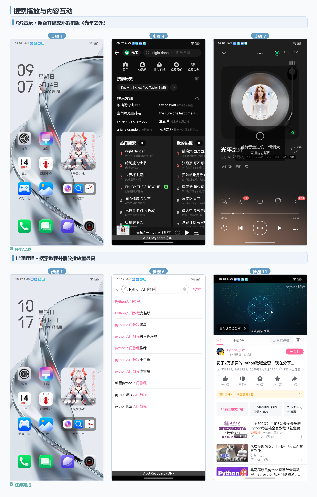
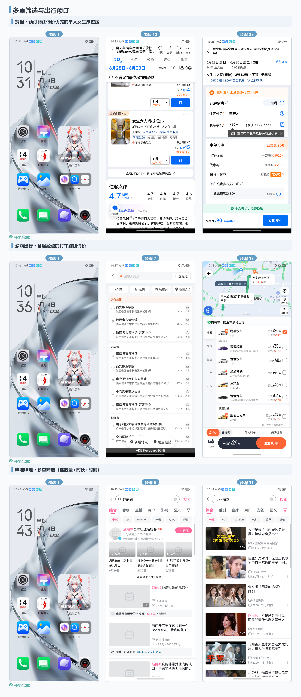
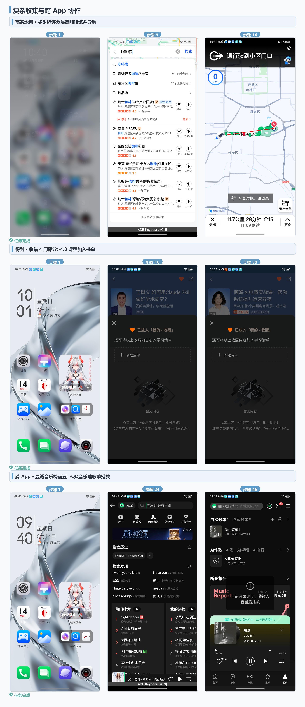
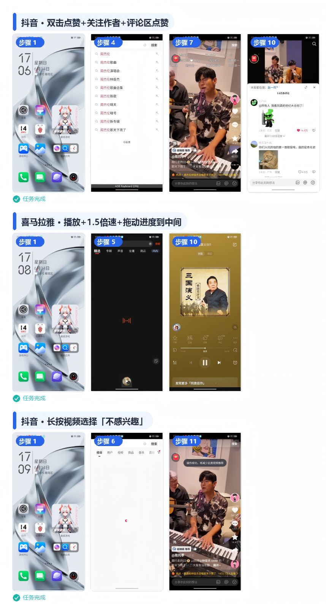
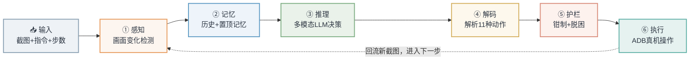
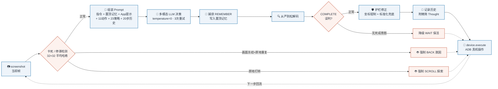
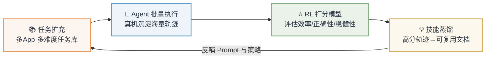

<div align="center">

# 🤖 GUI Agent · 通用安卓 GUI 智能体

**真机实时操控 · 多模态模型驱动 · 零任务硬编码**

> 一个运行在 PC 上、通过 ADB 实时操控安卓手机、仅凭「屏幕截图 + 中文指令」即可自主完成真实 App 任务的通用 GUI Agent。

<p>


</p>

<p>


</p>

> 🏆 本项目在 **第十六届「中兴捧月」全球精英挑战赛总决赛** 中荣获 **全国第二名**，并获得 **中兴校招 SSP 面试直通卡** 与 **5 万元奖金**。

</div>

---

<div align="center">

### 🎬 真机操作演示


<sub>▶ 真机实时操控 · 自动完成「高德地图找附近评分最高咖啡馆并导航」全流程</sub>

</div>

---

## 📑 目录

- [项目背景](#-项目背景)
- [真机测试结果](#-真机测试结果)
- [核心亮点](#-核心亮点)
- [整体架构](#-整体架构)
- [单步决策数据流](#-单步决策数据流)
- [核心设计详解](#-核心设计详解)
- [11 种动作空间](#-11-种动作空间)
- [项目结构](#-项目结构)
- [快速开始](#-快速开始)
- [拓展思考：数据飞轮](#-拓展思考数据飞轮)
- [技术栈与工程实践](#-技术栈与工程实践)
- [致谢](#-致谢)

---

## 🌟 项目背景

随着多模态大模型（Multimodal LLM）能力的飞跃，让 AI **像人一样「看屏幕、点屏幕」操作手机**成为可能。本项目源自 **「捧月 2026」算法大赛决赛** 赛题，目标是构建一个**通用 GUI Agent**：

- **运行环境**：Agent 跑在 Windows 电脑上，通过 **ADB（Android Debug Bridge）实时操控一台真实安卓手机**——不是模拟器、不是静态数据集，而是会弹广告、会卡加载、会跳转登录的真实 App 环境。
- **任务形态**：用户给一句中文自然语言指令（如「在 QQ 音乐搜索光年之外并播放邓紫棋演唱的版本」），Agent 需自主拆解、逐步操作，直至完成。
- **极简输入**：每一步框架**只提供三个字段**——`手机当前截图` + `中文指令` + `当前步数`，**不回传任何历史**。Agent 必须在内部自己维护「我做过什么、记住了什么」。
- **真实评判**：由评委**观看完整执行录像人工打分**，因此动作不仅要「对」，还要**稳健、可读、少冗余**。

### 这有多难？—— 决赛 vs 初赛

| 维度 | 初赛 | 决赛 | 本方案应对 |
|---|---|---|---|
| 截图来源 | 静态数据集 | **手机实时 ADB 截图** | 模型驱动、按实际界面决策 |
| 动作空间 | 5 种 | **11 种** | 解析器 / Prompt 全量覆盖 |
| 历史信息 | 框架回传 | **完全不回传** | Agent 内部自维护历史 + 带键记忆 |
| 判分方式 | 脚本自动比对 | **评委看全过程** | 动作稳健、可读、少冗余 |
| 任务复杂度 | 单 App 短流程 | **跨 App 长程协作（最多 80 步）** | 持久化规划 + 进度追踪 |

> 💡 **核心理念**：**不写任何针对具体任务的硬编码坐标 / 分支**。所有任务知识都以**可泛化的「软策略」**形式提供给模型，让 Agent 面对从未见过的 App 与任务也能合理决策。

---

## 📊 真机测试结果

> 全部为 **真机实时运行** 的真实截图（非模拟器、非拼接演示）。覆盖 **电商、视频、音频、地图出行、音乐、学习资讯及跨 App 协作** 等典型场景，所有用例均 `agent_completed`，且 **实际步数显著低于步数上限**，兼顾高效与稳健。

<table>
<tr><th align="center">场景</th><th>代表任务</th><th align="center">难点</th></tr>
<tr>
<td align="center"><b>🔍 搜索播放<br/>与内容互动</b></td>
<td>「QQ 音乐搜索<i>光年之外</i>并播放邓紫棋演唱的版本」<br/>「哔哩哔哩搜索 Python 入门教程，播放播放量最高的」</td>
<td align="center">灰色占位符识别<br/>精准提交</td>
</tr>
<tr>
<td align="center"><b>🧳 多重筛选<br/>与出行预订</b></td>
<td>「携程预订 6/28–6/30 丽江低价优先的单人女生床位房」<br/>「滴滴查途经点询价」</td>
<td align="center">多条件筛选<br/>停在收银页不真支付</td>
</tr>
<tr>
<td align="center"><b>🔗 复杂收集<br/>与跨 App 协作</b></td>
<td>「得到搜索 skill 课程，收集 4 门评分 &gt;4.8 加入书单」<br/><b>「豆瓣音乐榜前五 → QQ 音乐建歌单并播放」</b>（跨 App 长任务）</td>
<td align="center">跨 App 状态保持<br/>逐项收集去重</td>
</tr>
<tr>
<td align="center"><b>🎛️ 多样<br/>高难交互</b></td>
<td>覆盖 <code>DOUBLE_CLICK</code> 双击点赞、<code>LONG_PRESS</code> 长按菜单、<code>DRAG</code> 拖动进度条 + 倍速</td>
<td align="center">稀有动作<br/>精细坐标控制</td>
</tr>
</table>

<details open>
<summary><b>🔍 案例一 · 搜索播放与内容互动</b></summary>



</details>

<details>
<summary><b>🧳 案例二 · 多重筛选与出行预订</b></summary>



</details>

<details>
<summary><b>🔗 案例三 · 复杂收集与跨 App 协作</b></summary>



</details>

<details>
<summary><b>🎛️ 案例四 · 多样高难交互动作</b></summary>



</details>

---

## ✨ 核心亮点

<table>
<tr>
<td width="50%" valign="top">

#### 🧠 自维护历史 + 带键置顶记忆
针对「框架不回传历史」，Agent 内部自管两类上下文：**动作历史**（最近 20 步）+ **REMEMBER 置顶记忆**（固定事实长期保留、过程信息同键覆盖），据此持久化跨几十步的计划与进度。
<br/><sub>→ <a href="#1-自维护历史--带键置顶记忆">详见设计 1</a></sub>

</td>
<td width="50%" valign="top">

#### 🔍 从严到松的稳健解析
面对模型五花八门的输出格式，解析器像「多层筛子」逐级放宽：剥离思考块 → 取最后决策 → 函数式 → 冒号式 → 宽松提取 → 兜底保活，保证**零非法动作中断**。
<br/><sub>→ <a href="#2-11-种动作的稳健解析">详见设计 2</a></sub>

</td>
</tr>
<tr>
<td width="50%" valign="top">

#### 📋 零硬编码的通用策略体系
**1 条 OPEN 启动纪律 + 23 条编号操作策略**，全部是可泛化的「操作常识」（搜索流程、无货换品、属性看图、逐项收集……），不绑定任何具体任务。
<br/><sub>→ <a href="#3-通用-prompt-与策略体系">详见设计 3</a></sub>

</td>
<td width="50%" valign="top">

#### ⛑ 精简软化的卡死脱困
基于 **32×32 平均哈希**的轻量画面变化检测，强制接管只收敛到「画面冻结 + 原地重复」等**绝对安全**的死局，既杜绝无限挂死，又绝不打断模型正常重试。
<br/><sub>→ <a href="#5-界面停滞反思--卡死强制脱困">详见设计 5</a></sub>

</td>
</tr>
</table>

---

## 🏗 整体架构

围绕 **「感知 → 记忆 → 推理 → 解码 → 护栏 → 执行」** 构建单步闭环，执行结果回流为下一步的截图，形成自洽的 **ReAct 循环**。



> **为什么选 ReAct 循环，而非 Plan-and-Execute？**
> 手机真实环境**高度不确定**——广告弹窗、加载延迟、页面布局变化随时发生。提前规划好的多步计划很容易因为一个意外弹窗就全盘失效；而 ReAct 每一步都基于**最新截图重新决策**，天然适应这种"走一步看一步"的动态环境，鲁棒性远胜 Plan-and-Execute。

---

## 🔄 单步决策数据流

每次 `Agent.act()` 调用内部的完整处理链路（横向阅读）：



---

## 🔧 核心设计详解

> 六阶段闭环中最关键的六个设计，逐一拆解「**要解决什么问题 → 怎么做**」。

<table><tr>
<td>🧠 <a href="#1-自维护历史--带键置顶记忆">自维护记忆</a></td>
<td>🔍 <a href="#2-11-种动作的稳健解析">稳健解析</a></td>
<td>📋 <a href="#3-通用-prompt-与策略体系">通用策略</a></td>
<td>🛡 <a href="#4-轻量通用护栏">通用护栏</a></td>
<td>⛑ <a href="#5-界面停滞反思--卡死强制脱困">卡死脱困</a></td>
<td>🎯 <a href="#6-按需-app-专属提示">App 提示</a></td>
</tr></table>

### 1. 自维护历史 + 带键置顶记忆

> **痛点**：框架每步只传当前截图、**不回传历史**，模型天然「失忆」。

Agent 在进程内自管两类上下文，全部**只存文本摘要、不存历史截图**，严格控制 token：

| 记忆类型 | 存储形式 | 机制 |
|---|---|---|
| **动作历史** | `List[{step, action, params, note}]` | 渲染**最近 20 步**（`HISTORY_WINDOW=20`）注入 Prompt，每条附精简 Thought 作观察备注，提供上下文与防重复依据 |
| **带键置顶记忆** | 有序字典 `store_key → (展示键, 值)` | 📌 `REMEMBER: 值` 固定事实按内容去重、长期保留；🔄 `REMEMBER【键】: 值` 过程信息**同键覆盖**避免旧快照堆积 |

- **容量上限** `16 条 × 500 字符`，渲染为 `## Key Info To Remember (pinned)` **永久钉在 Prompt 顶部**，不随历史窗口滚走。
- **持久化规划**：对「≥4 子目标」长任务，引导模型首步用 `REMEMBER【计划】` 钉住有序计划，用 `REMEMBER【进度】`（同键覆盖）随完成刷新，**跨几十步不丢线**。
- `reset()` 在每个用例开始清空，杜绝跨用例污染。

### 2. 11 种动作的稳健解析

> **痛点**：模型输出格式五花八门，任一非法动作都会中断整局。 `utils/finals_decoder.py`

「从严到松」多级解析链，**层层放宽、绝不空手而归**：

```text
剥离 <think> 思考块
 └─ 取最后一条 Action:（模型自我纠正后的最终决策）
     └─ 函数式 name(args)
         └─ 冒号式 CLICK:[[x,y]]
             └─ 宽松兜底提取坐标
                 └─ 仍失败 → 兜底 COMPLETE（保活不崩）
```

- 坐标兼容 `<point>x y</point>` / `[x,y]` / `x,y` / `x y` 多种写法，统一钳制到 `[0,1000]`。
- `double_click` 先于 `click` 匹配（避免子串误判）；`<enter>` / `回车` 归一为换行符，供无搜索键 App 提交。

### 3. 通用 Prompt 与策略体系

> **痛点**：既要泛化到任意 App，又不能写死任何任务。 `utils/finals_prompt.py`

写给模型的一套「操作手册」：**完整动作空间 + 坐标系说明 + 1 条置顶 OPEN 纪律 + 23 条编号策略**，全部为通用软技能、零任务硬编码。摘录：

- **OPEN 启动纪律**：启动任何 App 一律 `open(app_name='中文全名')`，绝不在桌面找图标。
- **搜索流程**：识别灰色占位符 → 聚焦 → 输入 → 确认 → 提交，不反复清空空框。
- **电商**：属性无选项先看图确认、**无货换品不假完成**、订单停在收银页不真支付。
- **收集 N 个**：逐项进详情看属性、`REMEMBER` 记录已加 / 已拒。
- **卡住自救**：先重看截图再决定换元素 / 返回 / 再等。

### 4. 轻量通用护栏

> **痛点**：模型偶发的越界、空转、误判需要「兜底纠错」，但又不能过度干预。 `agent.py`

| 护栏 | 触发条件 | 处理 |
|---|---|---|
| 过早 COMPLETE 拦截 | 未做实质操作即想完成 | 改为探索性滚动 |
| 动作循环检测 | 连续 3 次完全相同动作 | 升级式打破（绝不强制 COMPLETE） |
| OPEN 规范化 | 别名 / 重复打开 | 别名归一 + 提示换同类应用 |
| 滑动幅度钳制 | 单次位移 > 150 | 截断到约 15% 屏，防划过目标 |
| 空响应保活 | 模型多次空返回 | 降级一次 WAIT，绝不输出空动作 |

### 5. 界面停滞反思 + 卡死强制脱困

> **痛点**：真机会卡加载、死循环，需检测「画面是否真的变了」。 ReAct 中的 reflection

对相邻帧截图做 **32×32 灰度平均哈希（1024 位）** 算汉明距离（阈值 10），细网格能识别「展开下拉 / 勾选筛选」等小幅变化。**设计原则：强制接管只保留「绝对安全」的死局**：

- **强制 BACK（仅 2 类）**：① 连续 ≥6 步「画面不变且原地戳同一处」；② 连续 5 步纯 WAIT 且画面冻结（死加载）。
- **强制 SCROLL**：动作循环 / 连戳同一小块 → 探索滚动打破。

> 早期版本的「横跳 BACK / 反复点击软提示」实测会干扰正常重试，已**移除**，把强制接管收敛到上述绝对安全场景。

### 6. 按需 App 专属提示

> **痛点**：少数 App 因入口隐蔽而易失败，需针对性提示但不污染通用性。 `APP_HINTS`

针对「确因找不到入口而易失败」的常用 App，维护一张极简提示表，**仅命中时注入一条**（不撑 token）。命中方式：指令显式名优先 + 意图关键词兜底（如「导航 / 路线」→ 高德地图）。

---

## 🎮 11 种动作空间

统一的动作接口，覆盖真实 App 操作所需的全部交互；解码器保证任意模型输出都能归一到这 11 种之一。

| 类别 | 动作 | 参数 | 说明 |
|:--|:--|:--|:--|
| **👆 点击类** | `CLICK` | `point` | 单击 |
| | `DOUBLE_CLICK` | `point` | 双击（如点赞） |
| | `LONG_PRESS` | `point` + `duration` | 长按（如呼出菜单） |
| **✋ 滑动 / 拖拽** | `SCROLL` | `start_point` + `end_point` | 滚动 |
| | `DRAG` | `start_point` + `end_point` | 拖动（如进度条 / 滑块） |
| **⌨️ 文本 / 应用** | `TYPE` | `text` | 输入文本 |
| | `OPEN` | `app_name` | 按包名直接拉起 App |
| **🧭 系统导航** | `BACK` | — | 返回 |
| | `HOME` | — | 回桌面 |
| | `WAIT` | `seconds` | 等待加载 |
| **✅ 任务控制** | `COMPLETE` | `content` | 标记任务完成 |

---

## 📂 项目结构

```
GUI Agent/
├── README.md                  # 本文档
├── agent.py                   # ⭐ 核心：通用 GUI Agent（历史/记忆/护栏/脱困）
├── agent_base.py              # 基类：模型调用、图像编码、动作校验（赛题框架）
├── device_controller.py       # ADB 设备控制：截图、执行动作、输入法切换
├── test_runner.py             # 批量测试执行器
├── run_tests.py               # 命令行入口
├── requirements.txt           # 依赖清单
├── ADBKeyboard.apk            # 中文输入法（adb 输入中文必需）
├── utils/
│   ├── finals_decoder.py      # ⭐ 11 动作从严到松解析 + 坐标钳制
│   ├── finals_prompt.py       # ⭐ 通用 Prompt + 23 策略 + App 提示 + 历史渲染
│   ├── image_utils.py         # 图像处理工具
│   └── visualize.py           # 执行过程可视化
├── tasks/
│   └── tasks.json             # 任务定义（指令 / App / 步数上限）
├── docs/
│   └── 算法设计说明.md         # 完整算法设计文档
└── assets/                    # 真机执行案例截图
```

---

## 🚀 快速开始

### 1️⃣ 环境准备

- Python 3.10+
- 一台开启 **USB 调试** 的安卓手机（或安卓模拟器）
- PC 已安装 [ADB（Android Platform Tools）](https://developer.android.com/tools/releases/platform-tools) 并配置进 PATH

### 2️⃣ 安装依赖

```bash
pip install -r requirements.txt
```

### 3️⃣ 配置模型 API Key

> 🔒 **安全说明**：API Key **仅通过环境变量读取，绝不硬编码进代码**。

```powershell
# Windows PowerShell
$env:VLM_API_KEY = "<你的多模态大模型 API Key>"
```
```bash
# Linux / macOS
export VLM_API_KEY="<你的多模态大模型 API Key>"
```

### 4️⃣ 安装并启用 ADB 中文输入法

```bash
adb install ADBKeyboard.apk
# 然后在手机上：设置 → 语言和输入法 → 虚拟键盘 → 启用 "ADB Keyboard"
```

### 5️⃣ 连接手机并运行

```bash
adb devices                          # 确认设备已连接并授权
python run_tests.py                  # 自动检测设备，跑全部任务
python run_tests.py --serial <设备ID> # 指定设备
python run_tests.py --resume         # 断点续跑
python run_tests.py --tasks my_tasks.json --output my_output/  # 自定义任务与输出
```

运行后会在输出目录生成每题的 `data.json`（完整动作轨迹）、逐步截图与 `summary.png`。

---

## 🔮 拓展思考：数据飞轮

不止于「跑通任务」，而是构建一个**让 Agent 在自我迭代中持续变强**的闭环：



| 环节 | 做什么 | 数据 / 模型 |
|---|---|---|
| **任务扩充** | 持续扩充多 App、多难度任务库，覆盖长尾交互 | 结构化提示 + 难度分级标注 |
| **Agent 批量执行** | 真机批量自动执行，沉淀大量操作轨迹 | 截图序列 + 动作序列 + 成败元信息 |
| **RL 打分模型** | 训练奖励模型对轨迹评分作为奖励信号 | 以轻量 LLM 为基座，用 `(轨迹, 人工/规则标注分)` 微调 |
| **技能蒸馏** | 高分轨迹蒸馏为可复用 App 技能文档 | 反哺 Prompt 策略与按需提示 |

---

## 🛠 技术栈与工程实践

| 维度 | 说明 |
|:--|:--|
| **🐍 语言** | Python 3.10+，核心逻辑**纯标准库 + Pillow** 实现，无新增重依赖 |
| **🧠 模型** | 多模态大模型（Multimodal LLM），`temperature=0` 保证复看一致，`max_tokens=1500` 防 Action 被长思考截断 |
| **📱 设备** | ADB 实时截图 + 动作下发，ADB Keyboard 解决中文输入 |
| **🛡 鲁棒性** | 3 次重试 + 线性退避；所有输出经标准化兜底，必过框架动作校验，**结构上不存在无限挂死** |
| **🔒 安全** | API Key 仅走环境变量；日志截断打印，不泄露 Key / 大图 base64 |

---

## 🙏 致谢

本项目源自 **「捧月 2026」算法大赛决赛**赛题。其中 `agent_base.py`、`device_controller.py`、`test_runner.py`、`run_tests.py`、`utils/image_utils.py`、`utils/visualize.py` 为赛题官方框架；本项目的核心贡献在于 **`agent.py`** 及 **`utils/finals_decoder.py`**、**`utils/finals_prompt.py`** —— 一套通用、模型驱动、零任务硬编码的 GUI Agent 实现。

完整算法设计见 [`docs/算法设计说明.md`](docs/算法设计说明.md)。

---

<div align="center">

### ⭐ 通用 GUI Agent · 模型驱动 · 数据飞轮持续进化

**如果这个项目对你有启发或帮助，欢迎点亮 Star 支持一下 🌟**

<sub>你的 Star 是持续开源与迭代的最大动力</sub>

</div>
